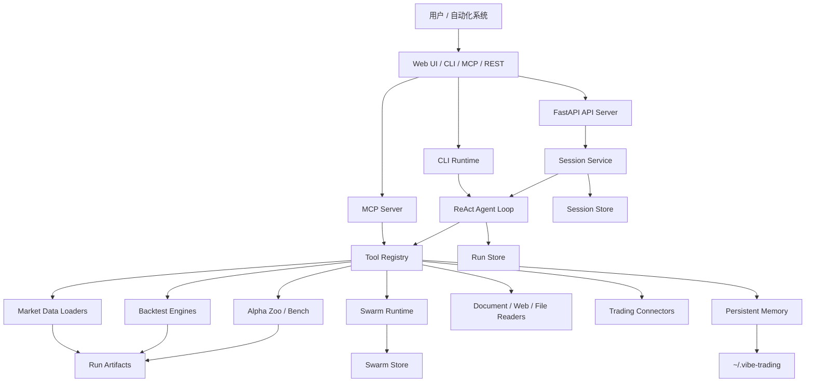

# 架构设计

## 总体架构



## 分层说明

### 入口层

入口层负责接收用户任务，并把请求转成内部任务模型。

- Web UI：位于 `frontend/`，面向浏览器用户。
- REST API：位于 `agent/api_server.py`，提供 session、run、upload、swarm、alpha、settings 等接口。
- CLI：位于 `agent/cli/`，支持交互式 TUI 和命令式同步任务。
- MCP Server：位于 `agent/mcp_server.py`，把项目能力暴露给 MCP 客户端。

### Agent 编排层

核心在 `agent/src/agent/`：

- `loop.py`：ReAct 风格 Agent 主循环，负责模型调用、工具调用、取消、超时、trace、run 状态。
- `context.py`：构建系统提示词、注入 memory、skills、目标上下文。
- `skills.py`：加载内置和用户自建 skills。
- `trace.py`：记录执行轨迹，便于调试和复盘。
- `memory.py`：单次运行内的工作区状态。

### 工具层

工具位于 `agent/src/tools/`，通过 registry 自动发现并注册。工具把 Agent 的自然语言决策连接到具体能力，例如：

- `backtest_tool.py`：回测。
- `market_data_tool.py`：行情查询。
- `swarm_tool.py`：多智能体任务。
- `alpha_bench_tool.py`、`alpha_compare_tool.py`：因子评测和对比。
- `doc_reader_tool.py`、`web_reader_tool.py`、`web_search_tool.py`：文档和网页读取。
- `trade_journal_tool.py`、`shadow_account_tool.py`：交易流水和 Shadow Account。
- `trading_connector_tool.py`：券商连接器。

### 数据和计算层

- 行情 loader：`agent/backtest/loaders/`
- 回测 engine：`agent/backtest/engines/`
- 组合优化器：`agent/backtest/optimizers/`
- Alpha 因子库：`agent/src/factors/`
- Swarm DAG 运行时：`agent/src/swarm/`
- 交易连接器：`agent/src/trading/connectors/`

### 存储层

项目使用轻量文件型持久化，而不是单一中心数据库。

- run：`agent/runs/{run_id}/`
- session：`agent/sessions/{session_id}/`
- session search / goal：`~/.vibe-trading/sessions.db`
- memory：`~/.vibe-trading/memory/`
- swarm：`agent/.swarm/runs/{run_id}/`
- uploads：`agent/uploads/`
- live trading state：`~/.vibe-trading/live/`

Docker 部署时可通过 bind mount 把这些目录挂到宿主机。

## 请求链路

### Web 对话任务

```text
Web UI
  -> POST /sessions
  -> POST /sessions/{id}/messages
  -> SessionService
  -> AgentLoop
  -> ToolRegistry
  -> Run artifacts
  -> GET /sessions/{id}/events 获取 SSE 进度
  -> GET /runs/{run_id} 获取最终产物
```

### CLI 同步任务

```text
vibe-trading run -p "任务"
  -> CLI command
  -> AgentLoop
  -> ToolRegistry
  -> 终端同步等待
  -> agent/runs 写入产物
```

### Swarm 长任务

```text
POST /swarm/runs 或 CLI --swarm-run
  -> SwarmRuntime
  -> SwarmStore 创建 run.json/events.jsonl/tasks
  -> Worker 并发执行
  -> SSE events 推送 worker 状态
  -> artifacts 汇总报告
```

