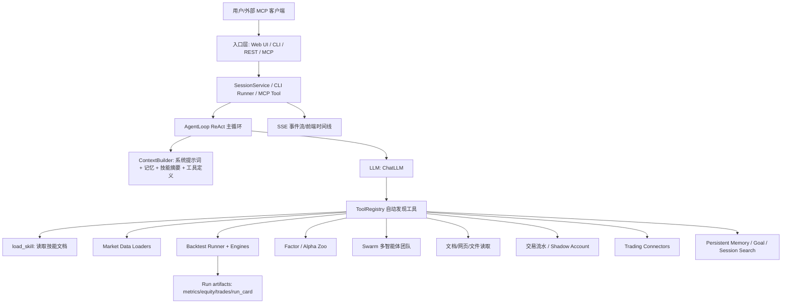

下面是我按源码梳理出的项目架构与完整工作原理。结论先说：这是一个“自然语言金融研究 Agent 工作台”，核心不是单一回测脚本，而是 **入口层(Web/CLI/MCP/API) -> Agent ReAct 编排层 -> Skills 方法论层 -> Tools 可执行工具层 -> 数据/回测/因子/交易/报告计算层 -> 文件型持久化层**。

**整体架构**

**顶层模块**
- [agent](/Users/pengying/workspace/ai-finance-os/Vibe-Trading/agent)：Python 后端主体，包含 API、CLI、MCP、Agent、工具、回测、因子、交易连接器。
- [frontend](/Users/pengying/workspace/ai-finance-os/Vibe-Trading/frontend)：React Web UI，聊天页、Run 详情页、AlphaZoo、相关性、Settings 等。
- [agent/src/agent](/Users/pengying/workspace/ai-finance-os/Vibe-Trading/agent/src/agent)：Agent 编排核心。
- [agent/src/tools](/Users/pengying/workspace/ai-finance-os/Vibe-Trading/agent/src/tools)：工具注册和所有可执行能力。
- [agent/src/skills](/Users/pengying/workspace/ai-finance-os/Vibe-Trading/agent/src/skills)：内置技能库，本质是任务方法论和工具使用契约。
- [agent/backtest](/Users/pengying/workspace/ai-finance-os/Vibe-Trading/agent/backtest)：数据加载、回测引擎、指标、组合优化。
- [agent/src/factors](/Users/pengying/workspace/ai-finance-os/Vibe-Trading/agent/src/factors)：Alpha Zoo、因子注册、IC/IR 评测。
- [agent/src/swarm](/Users/pengying/workspace/ai-finance-os/Vibe-Trading/agent/src/swarm)：多智能体团队预设和 DAG 运行时。
- [agent/src/trading](/Users/pengying/workspace/ai-finance-os/Vibe-Trading/agent/src/trading) 与 [agent/src/live](/Users/pengying/workspace/ai-finance-os/Vibe-Trading/agent/src/live)：券商连接器、mandate、kill switch、审计。

**核心设计**
项目把“技能”和“工具”分开：

- **Skill 技能**：Markdown 文档，告诉 Agent 某类任务该怎么做、注意什么、用什么参数。加载逻辑在 [skills.py](/Users/pengying/workspace/ai-finance-os/Vibe-Trading/agent/src/agent/skills.py)，执行入口是 [load_skill_tool.py](/Users/pengying/workspace/ai-finance-os/Vibe-Trading/agent/src/tools/load_skill_tool.py)。
- **Tool 工具**：真正执行动作的 Python 类，统一继承 `BaseTool`。基础接口在 [tools.py](/Users/pengying/workspace/ai-finance-os/Vibe-Trading/agent/src/agent/tools.py)，自动注册逻辑在 [agent/src/tools/__init__.py](/Users/pengying/workspace/ai-finance-os/Vibe-Trading/agent/src/tools/__init__.py)。新增一个 `src/tools/*.py` 并定义 `BaseTool` 子类，就能自动进入工具注册表。

**用户问题的完整分析流程**
1. **入口接收**
   - Web：前端 [Agent.tsx](/Users/pengying/workspace/ai-finance-os/Vibe-Trading/frontend/src/pages/Agent.tsx) 调 `/sessions/{id}/messages`，后端路由在 [api_server.py](/Users/pengying/workspace/ai-finance-os/Vibe-Trading/agent/api_server.py)。
   - CLI：入口在 [cli/main.py](/Users/pengying/workspace/ai-finance-os/Vibe-Trading/agent/cli/main.py)，非交互命令交给 legacy 命令层。
   - MCP：入口在 [mcp_server.py](/Users/pengying/workspace/ai-finance-os/Vibe-Trading/agent/mcp_server.py)，把项目能力暴露成 MCP tools。
   - REST：同样由 [api_server.py](/Users/pengying/workspace/ai-finance-os/Vibe-Trading/agent/api_server.py) 提供 runs、sessions、upload、swarm、alpha、settings 等接口。

2. **会话编排**
   - Web 消息进入 [SessionService](/Users/pengying/workspace/ai-finance-os/Vibe-Trading/agent/src/session/service.py)。
   - `send_message()` 创建 `Message` 和 `Attempt`，写入 session store，发出 SSE 事件。
   - `_run_with_agent()` 构造 `ChatLLM`、`PersistentMemory`、`ToolRegistry`，然后启动 `AgentLoop`。
   - 运行过程事件通过 `event_callback` 转成 SSE，前端聊天页显示 thinking、tool_call、tool_result、swarm status、goal progress 等。

3. **构造 Agent 上下文**
   - [ContextBuilder](/Users/pengying/workspace/ai-finance-os/Vibe-Trading/agent/src/agent/context.py) 生成系统提示词。
   - 注入内容包括：工具列表、技能摘要、当前 run 工作区、跨 session 记忆、任务路由规则、当前日期。
   - 系统提示词明确规定：回测先 `load_skill("strategy-generate")`，再写 `config.json` 和 `code/signal_engine.py`，最后调用 `backtest`；交易流水先 `trade-journal`；Shadow Account 必须先加载 `shadow-account` 技能。

4. **ReAct 主循环**
   - 主循环在 [loop.py](/Users/pengying/workspace/ai-finance-os/Vibe-Trading/agent/src/agent/loop.py)。
   - 每轮流程是：压缩上下文 -> 调 LLM -> 判断是否有 tool calls -> 执行工具 -> 工具结果回填给 LLM -> 直到模型输出 final answer。
   - 只读工具可并行执行；写工具、回测、文件编辑等串行执行。
   - 每次工具调用会写 trace、发 SSE 事件、记录耗时、处理超时和 heartbeat。
   - 运行产物写到 `agent/runs/{run_id}`，会话 trace 写到 `agent/sessions/{session_id}`。

5. **工具注册与调用**
   - `build_registry()` 会导入 [agent/src/tools](/Users/pengying/workspace/ai-finance-os/Vibe-Trading/agent/src/tools) 下所有模块，收集 `BaseTool.__subclasses__()`。
   - 常见工具包括：
     - `load_skill`
     - `get_market_data`
     - `backtest`
     - `factor_analysis`
     - `alpha_bench` / `alpha_compare` / `alpha_zoo`
     - `run_swarm`
     - `read_document` / `read_url` / `web_search`
     - `analyze_trade_journal`
     - `extract_shadow_strategy` / `run_shadow_backtest` / `render_shadow_report`
     - `trading_*`
     - `remember`
     - `read_file` / `write_file` / `edit_file`

**主要任务流程节点与调用模块/技能**

| 用户意图 | 流程节点 | 调用技能 | 调用工具/模块 |
|---|---|---|---|
| 普通金融研究 | 识别问题 -> 加载相关技能 -> 搜索/读网页/读文档/取行情 -> 汇总 | 如 `macro-analysis`、`financial-statement`、`risk-analysis`、`web-reader` | `load_skill`、`web_search`、`read_url`、`read_document`、`get_market_data` |
| 策略回测 | 加载策略契约 -> 写配置 -> 写 SignalEngine -> 调回测 -> 读指标/报告 | `strategy-generate`，也可能用 `technical-basic`、`multi-factor`、`event-driven` 等 | `write_file`、`backtest`、`read_file`；底层进入 [backtest_tool.py](/Users/pengying/workspace/ai-finance-os/Vibe-Trading/agent/src/tools/backtest_tool.py) 和 [backtest/runner.py](/Users/pengying/workspace/ai-finance-os/Vibe-Trading/agent/backtest/runner.py) |
| 获取行情 | 识别代码市场 -> 选择 source/auto -> loader 获取 OHLCV -> JSON 返回 | `data-routing`、`yfinance`、`tushare`、`okx-market`、`akshare` 等 | `get_market_data` -> [market_data.py](/Users/pengying/workspace/ai-finance-os/Vibe-Trading/agent/src/market_data.py) -> [loaders/registry.py](/Users/pengying/workspace/ai-finance-os/Vibe-Trading/agent/backtest/loaders/registry.py) |
| 因子分析 | 准备 factor/return CSV -> 算 IC/IR -> 分组净值 -> 输出结果 | `factor-research`、`multi-factor`、`alpha-zoo` | `factor_analysis` -> [factor_analysis_tool.py](/Users/pengying/workspace/ai-finance-os/Vibe-Trading/agent/src/tools/factor_analysis_tool.py) |
| Alpha Zoo 横评 | 选择 zoo/universe/period -> 加载面板 -> 逐因子计算 -> 排名报告 | `alpha-zoo` | `alpha_bench` / `alpha_compare` -> [alpha_bench_tool.py](/Users/pengying/workspace/ai-finance-os/Vibe-Trading/agent/src/tools/alpha_bench_tool.py)、[src/factors](/Users/pengying/workspace/ai-finance-os/Vibe-Trading/agent/src/factors) |
| 多智能体团队 | 用户明确要求团队/委员会/swarm -> 选择 preset -> DAG worker 并发 -> 汇总报告 | preset 内部定义角色；可结合行情/研究技能 | `run_swarm` -> [swarm_tool.py](/Users/pengying/workspace/ai-finance-os/Vibe-Trading/agent/src/tools/swarm_tool.py) -> [src/swarm/runtime.py](/Users/pengying/workspace/ai-finance-os/Vibe-Trading/agent/src/swarm/runtime.py) |
| 交易流水复盘 | 上传 CSV/Excel -> 标准化解析 -> FIFO 配对 -> 行为偏差诊断 | `trade-journal` | `analyze_trade_journal` -> [trade_journal_tool.py](/Users/pengying/workspace/ai-finance-os/Vibe-Trading/agent/src/tools/trade_journal_tool.py) |
| Shadow Account | 先读技能 -> 提取盈利行为规则 -> 多市场 shadow 回测 -> 生成报告 | `shadow-account` | `extract_shadow_strategy`、`run_shadow_backtest`、`render_shadow_report` -> [shadow_account_tool.py](/Users/pengying/workspace/ai-finance-os/Vibe-Trading/agent/src/tools/shadow_account_tool.py)、[src/shadow_account](/Users/pengying/workspace/ai-finance-os/Vibe-Trading/agent/src/shadow_account) |
| 交易连接器 | 读取 profile -> 检查账户/持仓/订单/行情 -> mandate/kill switch 审计 | `execution-model`、`risk-analysis`，以及 connector 相关上下文 | `trading_connections`、`trading_account`、`trading_positions`、`trading_place_order` 等 -> [trading_connector_tool.py](/Users/pengying/workspace/ai-finance-os/Vibe-Trading/agent/src/tools/trading_connector_tool.py) |
| 记忆/长期研究目标 | 自动召回记忆 -> 目标 ledger -> 记录证据 -> 判断完成/阻塞 | `research-goal` | `remember`、`session_search`、`goal_tool` -> [src/goal](/Users/pengying/workspace/ai-finance-os/Vibe-Trading/agent/src/goal)、[src/memory](/Users/pengying/workspace/ai-finance-os/Vibe-Trading/agent/src/memory) |

**回测内部工作原理**
1. Agent 按技能要求生成两个关键文件：
   - `config.json`：代码、日期、数据源、interval、engine、参数。
   - `code/signal_engine.py`：必须定义 `SignalEngine`，提供 `generate(data_map)`。
2. `backtest` 工具校验 run_dir、配置、数据源、SignalEngine 文件。
3. [Runner](/Users/pengying/workspace/ai-finance-os/Vibe-Trading/agent/src/core/runner.py) 启动子进程执行 [backtest/runner.py](/Users/pengying/workspace/ai-finance-os/Vibe-Trading/agent/backtest/runner.py)。
4. `backtest.runner`：
   - 用 Pydantic 校验配置。
   - AST 检查 `signal_engine.py`，阻止危险的 import-time 执行。
   - 根据 `source` 或 `auto` 调 loader。
   - 根据 symbol 市场选择 engine：
     - A 股：`ChinaAEngine`
     - 美/港股：`GlobalEquityEngine`
     - Crypto：`CryptoEngine`
     - 期货：`ChinaFuturesEngine` / `GlobalFuturesEngine`
     - 外汇：`ForexEngine`
     - 跨市场：`CompositeEngine`
     - 期权组合：`options_portfolio`
5. 引擎输出：
   - `artifacts/equity.csv`
   - `artifacts/metrics.csv`
   - `artifacts/trades.csv`
   - `run_card.json`
   - `run_card.md`
6. Web 的 [RunDetail.tsx](/Users/pengying/workspace/ai-finance-os/Vibe-Trading/frontend/src/pages/RunDetail.tsx) 会读取 run 详情、图表数据、交易记录、代码和 run card。

**数据源路由**
数据源统一由 [loaders/registry.py](/Users/pengying/workspace/ai-finance-os/Vibe-Trading/agent/backtest/loaders/registry.py) 管理。支持：
- `tushare`
- `okx`
- `yfinance`
- `akshare`
- `baostock`
- `tencent`
- `mootdx`
- `ccxt`
- `futu`
- `auto`

`auto` 会按代码格式识别市场并路由，例如：
- `000001.SZ` / `600000.SH` -> A 股 loader
- `AAPL.US` -> yfinance
- `700.HK` -> 港股
- `BTC-USDT` -> okx
- `BTC/USDT` -> ccxt

若首选数据源不可用，会按 fallback chain 尝试替代源。

**存储设计**
项目没有中心数据库，主要是文件型持久化：
- `agent/runs/{run_id}`：每次分析/回测的产物。
- `agent/sessions/{session_id}`：会话消息、trace。
- `~/.vibe-trading/sessions.db`：session 搜索/goal 索引。
- `~/.vibe-trading/memory`：跨 session 记忆。
- `agent/.swarm/runs/{run_id}`：swarm run、events、tasks、artifacts。
- `agent/uploads`：上传文件。
- `~/.vibe-trading/live`：live trading 状态、mandate、审计等。

**一句话总结**
这个项目的本质是一个金融研究 Agent 操作系统：LLM 不直接“算金融”，而是先通过技能选择方法论，再通过工具调用确定性模块完成数据获取、回测、因子评测、文档读取、多智能体研究、交易复盘和券商连接；所有中间过程通过 session、trace、SSE 和 run artifacts 持久化，方便前端展示、复盘和继续研究。